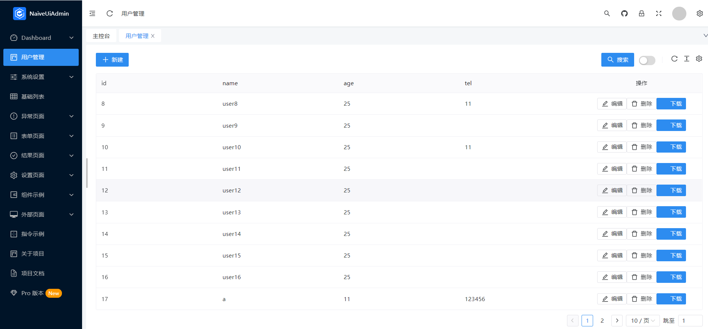

## 开发示例

在src/share/module下放了一个示例UserModule,可以参考该示例进行开发
同时在src/views/share下放了一个示例页面user.vue,可以参考该示例进行开发

## 运行效果



## 页面代码(user.vue)
    
```vue
    <template>
      <BaseComponent :module="UserModule" />
    </template>
    
    <script setup lang="ts">
      import BaseComponent from '@/share/components/BaseComponent.vue';
      import UserModule from '@/share/module/UserModule';
    </script>
```
## ts代码(UserModule.ts)
    
```ts
    import { Module } from '../core/Module';
    import { Config } from '../core/Config';
    import { reactive } from 'vue';
    
    class UserModule extends Module {
        columns = [
            {
                title: 'id',
                key: 'id',
                width: 200,
            },
            {
                title: 'name',
                key: 'name',
                width: 200,
            },
            {
                title: 'age',
                key: 'age',
                width: 200,
            },
            {
                title: 'tel',
                key: 'tel',
                width: 200,
            },
        ];
        schemas = [
            {
                field: 'name',
                component: 'NInput',
                label: '姓名',
                searchable: true, // 是否显示在搜索表单中
                componentProps: {
                    placeholder: '请输入姓名',
                    onInput: (e: any) => {
                        console.log(e);
                    },
                },
                rules: [{ required: true, message: '请输入姓名', trigger: ['blur'] }],
            },
            {
                field: 'tel',
                component: 'NInputNumber',
                label: '手机',
                searchable: true, // 是否显示在搜索表单中
                componentProps: {
                    placeholder: '请输入手机号码',
                    showButton: false,
                    onInput: (e: any) => {
                        console.log(e);
                    },
                },
            },
            {
                field: 'age',
                component: 'NInputNumber',
                label: '年龄',
                componentProps: {
                    placeholder: '请输入年龄',
                    showButton: false,
                    onInput: (e: any) => {
                        console.log(e);
                    },
                },
            },
        ];
    }
    
    export default (() => {
        const config = new Config({
            module: 'user',
            actions: [
                {
                    key: 'download',
                    label: '下载',
                    type: 'primary',
                    icon: 'el-icon-plus',
                    click: (record: any, module: Module) => {
                        console.log('新增', record);
                        console.log('module', module);
                    },
                },
            ],
            showRemoveBtn: true,
        });
        const module = reactive(new UserModule(config));
        console.log('module', module);
        return module;
    })();

```

## 代码说明
1. 所有Module,都需要继承Module,并且传入Config对象
2. 定义columns,该字段为表格的列定义
3. 定义schemas,该字段为表单的字段定义
